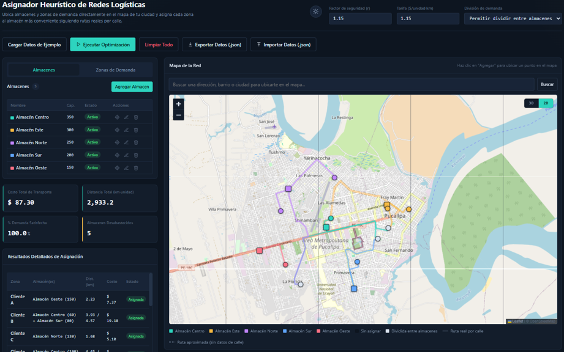

# Asignador Heurístico de Redes Logísticas (AHRL)

> Sistema interactivo de asignación óptima almacén–zona sobre un mapa real, con distancias reales por calle (OSRM) y solvers de investigación de operaciones (VAM + MODI / Branch & Bound).


---

## Tabla de contenidos

- [Descripción](#descripción)
- [Demo](#demo)
- [Características principales](#características-principales)
- [Stack tecnológico](#stack-tecnológico)
- [Arquitectura](#arquitectura)
- [Modelado matemático](#modelado-matemático)
- [Instalación y uso](#instalación-y-uso)
- [Requisitos del sistema](#requisitos-del-sistema)
- [Formato de intercambio (JSON)](#formato-de-intercambio-json)
- [Buenas prácticas de uso](#buenas-prácticas-de-uso)
- [Roadmap](#roadmap)
- [Autor](#autor)

---

## Descripción

En la gestión de cadenas de suministro, decidir **qué almacén atiende a cada zona de demanda** no es un ejercicio geométrico trivial: depende de la capacidad instalada, de la distancia real sobre la red vial y de si la política operativa permite o no fraccionar un pedido entre varios orígenes. Un error de asignación se traduce directamente en sobrecosto de transporte, saturación de depósitos y desabastecimiento de zonas.

**AHRL** es una solución portable, construida en un único archivo HTML5/JavaScript, que permite:

1. Construir sobre un **mapa real** la red de almacenes y zonas de demanda.
2. Calcular las **distancias reales por calle** mediante el motor de ruteo [OSRM](http://project-osrm.org/) (no distancia euclídea).
3. Resolver el problema de transporte/asignación resultante con **dos algoritmos de optimización** distintos, según la política de negocio.
4. Visualizar el resultado con **rutas, KPIs y estados operativos** directamente sobre el mapa.

A diferencia de una planilla estática con distancias digitadas a mano, AHRL obtiene rutas conducibles reales, aplica un factor de seguridad de circuidad configurable y entrega una asignación óptima o acotada junto con indicadores de costo, distancia ponderada, satisfacción de demanda y utilización de capacidad.

Geográficamente, la aplicación nace anclada a **Pucallpa (Ucayali, Perú)** como instancia de ejemplo, permitiendo auditar el diagnóstico logístico sobre la red vial amazónica real.

---

## Demo



**Demo en vivo:** [Abrir aplicación en GitHub Pages](https://teverde29.github.io/Asignador-Heuristico-de-Redes-Logisticas/)

---

## Características principales

- **Mapa interactivo** con vistas 2D (OpenStreetMap) y 3D/satelital (Esri World Imagery).
- **Geocodificación** de direcciones vía Nominatim (OpenStreetMap).
- **Picking en mapa**: los almacenes y zonas se georreferencian haciendo clic, nunca digitando coordenadas a mano.
- **Ruteo real por calle** con OSRM, incluyendo caché en memoria por par de coordenadas.
- **Degradación elegante**: si OSRM no responde, el sistema recurre a distancia de Haversine con factor de corrección, marcando la ruta como "estimada" en vez de fallar silenciosamente.
- **Dos motores de optimización**, según la política operativa:
  - **VAM + MODI** — Problema de Transporte clásico (con fraccionamiento de demanda entre almacenes).
  - **Branch & Bound** — Problema de Asignación Generalizada binario (sin fraccionamiento), con cotas duales, semilla voraz y poda por capacidad.
- **KPIs en vivo**: costo total, distancia ponderada (km·unidad), satisfacción de demanda y utilización de capacidad por almacén.
- **Semaforización de estados** por zona: Cubierta, Parcial o Sin capacidad.
- **Import/Export JSON** con validación estructural estricta (todo o nada) para portabilidad de la red entre equipos.
- **Tema claro/oscuro** persistido en `localStorage`.
- **Validación en vivo** de parámetros, confirmaciones destructivas y cancelación no destructiva de operaciones en curso.
- **Cero backend, cero build step**: un solo archivo HTML, ejecutable localmente o desde cualquier servidor estático.

---

## Stack tecnológico

| Capa | Tecnología | Función |
|---|---|---|
| Presentación | HTML5 + CSS3 | SPA, tema claro/oscuro, layout de dos columnas |
| Interacción | JavaScript Vanilla (ES, IIFE estricto) | Estado global, CRUD, validación, orquestación asíncrona |
| Cartografía | [Leaflet.js](https://leafletjs.com/) 1.9.4 + OpenStreetMap / Esri | Mapa 2D, vista satelital, marcadores y rutas |
| Geocodificación | [Nominatim](https://nominatim.org/) (OSM) | Búsqueda de direcciones, barrios y ciudades |
| Ruteo real | [OSRM](http://project-osrm.org/) (perfil *driving*) | Distancia y polilínea real por calle |
| Optimización | VAM + MODI / Branch & Bound | Asignación con o sin fraccionamiento (implementación propia) |
| Intercambio de datos | JSON (Blob API / FileReader) | Exportar, importar y validar la red |
| Tipografía | Inter (UI) + IBM Plex Mono (datos numéricos) | Google Fonts |

No se utilizan frameworks de componentes, bundlers ni librerías de gráficos de terceros. Toda la inteligencia analítica —incluido el método MODI y el árbol de Branch & Bound— está implementada desde cero en el propio archivo, lo que facilita la auditoría del código línea por línea.

---

## Arquitectura

AHRL sigue una arquitectura **SPA portable de archivo único**, ejecutada íntegramente del lado del cliente:

- Sin servidor de aplicación propio.
- Sin motor de base de datos relacional.
- Sin paso de compilación (*build step*).
- Única dependencia de red: teselas de mapa, geocodificación y ruteo (APIs públicas).

Esta decisión privilegia la **portabilidad absoluta** y la **auditoría directa del código fuente**, ideal para entornos académicos y de campo.

```
ahrl/
 └── index.html   # Interfaz + lógica de negocio + solvers, todo en un archivo
```

---

## Modelado matemático

El núcleo analítico implementa **dos regímenes de negocio** claramente diferenciados:

### 1. Modo "dividir" — Problema de Transporte (VAM + MODI)
Cuando la política permite fraccionar la demanda de una zona entre varios almacenes:
- **VAM** (Método de Aproximación de Vogel) construye la solución básica inicial.
- **MODI** (método u–v) itera hasta alcanzar la optimalidad.
- Se balancea la red con filas/columnas ficticias cuando oferta y demanda no coinciden.

### 2. Modo "no dividir" — Asignación Generalizada (Branch & Bound)
Cuando la política prohíbe fraccionar un pedido:
- Se formula como un **Problema de Asignación Generalizada binario**.
- Se resuelve por **Branch & Bound** con cotas duales, semilla voraz y poda por capacidad.
- Cada zona queda asignada completa a un único almacén, o explícitamente sin servir.
- Límite de tiempo configurable (por defecto, 3 s para instancias >20 zonas); si se excede, se reporta la mejor solución factible encontrada.

En ambos casos, cualquier inconsistencia (demanda insatisfecha, rutas aproximadas por fallo de OSRM, timeout de búsqueda exacta) se informa al operador mediante un modal de auditoría.

> La memoria descriptiva completa del proyecto —con el modelado matemático detallado, funciones de costo y pseudocódigo de los solvers— está disponible en [`/docs/memoria-descriptiva.pdf`](./docs).

---

## Instalación y uso

No requiere instalación de dependencias ni pasos de compilación.

```bash
# Clonar el repositorio
git clone https://github.com/TeVerde29/asignador-heuristico-redes-logisticas.git

# Entrar a la carpeta del proyecto
cd asignador-heuristico-redes-logisticas

# Abrir index.html directamente en el navegador
```

### Flujo básico de uso

1. **Agregar almacenes**: clic en "Nuevo almacén" → clic sobre el mapa para ubicarlo → completar nombre y capacidad.
2. **Agregar zonas de demanda**: mismo flujo, indicando la demanda requerida.
3. **Configurar parámetros globales**: factor de seguridad de circuidad (`r`) y tarifa por unidad/km (`τ`).
4. **Elegir política**: dividir (VAM+MODI) o no dividir (Branch & Bound).
5. **Ejecutar optimización** y revisar resultados en el mapa, la tabla y los KPIs.
6. **Exportar** la red en JSON para respaldo o para compartir con otro equipo.

---

## Requisitos del sistema

| Componente | Requisito mínimo |
|---|---|
| Procesador | Intel Core i3 o equivalente (doble núcleo) |
| Memoria RAM | 4 GB (8 GB recomendado para redes grandes) |
| Resolución | 1366×768 px mínimo |
| Navegador | Chrome, Firefox, Edge o Safari actualizados (HTML5, Fetch API, JS habilitado) |
| Conectividad | Requerida para mapas, geocodificación y ruteo (OSRM/Nominatim). Los solvers VAM+MODI y Branch & Bound son 100% locales. |

---

## Formato de intercambio (JSON)

La red completa (almacenes, zonas, parámetros y última optimización) puede exportarse e importarse como JSON, con validación estructural estricta ("todo o nada"): un error de sintaxis o de tipo rechaza la carga completa por diseño, para evitar estados corruptos.

```json
{
  "warehouses": [
    { "id": 1, "name": "Almacén Norte", "lat": -8.3791, "lng": -74.5539, "capacity": 500, "active": true }
  ],
  "zones": [
    { "id": 1, "name": "Zona Centro", "lat": -8.3765, "lng": -74.5490, "demand": 120 }
  ],
  "params": { "r": 1.15, "tariff": 0.8, "splitAllowed": true }
}
```

---

## Buenas prácticas de uso

- Georreferenciar siempre mediante *picking* en el mapa o búsqueda Nominatim — nunca inventar coordenadas.
- Usar capacidades **reales**, descontando reservas, merma y stock inmovilizado.
- Desactivar (no eliminar) almacenes para simular cierres temporales sin perder su historial geográfico.
- Interpretar los estados "Parcial" o "Sin capacidad" como diagnóstico, no como error del algoritmo.
- Exportar la red periódicamente: el archivo no persiste datos entre recargas del navegador (solo el tema visual).

---

## Roadmap

- [ ] Exportación de reporte en PDF con resumen ejecutivo
- [ ] Modo de comparación entre corridas (dividir vs. no dividir)
- [ ] Tests automatizados de los solvers (VAM+MODI, Branch & Bound)

---

## Autor

**Pedro Giovanni Ricra Figueroa**
Estudiante de Ingeniería de Sistemas — Universidad Nacional de Ucayali

- GitHub: [@TeVerde29](https://github.com/TeVerde29)
- LinkedIn: [Pedro Giovanni Ricra Figueroa](http://www.linkedin.com/in/pedro-giovanni-ricra-figueroa-971a20433)
- Email: pedro.ricra.figueroa@gmail.com

---

<div align="center">

Si este proyecto te resultó útil, considera darle una estrella en GitHub.

</div>